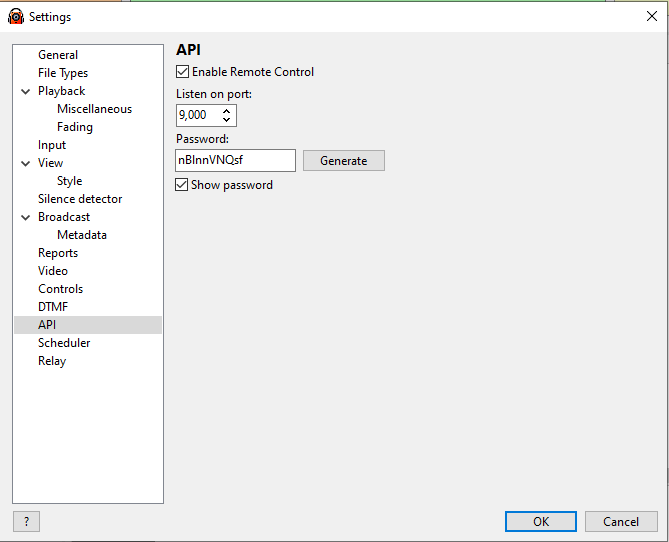

# DJ Soft Radio BOSS — Companion Module

> **Version 2.0.0**  
> Maintained by Marckenson John (MJS)

This module lets you control **DJ Soft Radio BOSS** software from a Bitfocus Companion button panel.

---

## Requirements

- Bitfocus Companion 3.x or later
- RadioBOSS 6.x or later
- **Remote Control API must be enabled** in RadioBOSS settings (see below)

---

## Setup

### 1. Enable the RadioBOSS Remote Control API

In RadioBOSS go to **Settings → Remote Control** and enable the HTTP API.  
Note the port number (default: **9000**) and set a password if desired.

### 2. Configure the module in Companion

| Field | Description |
|---|---|
| **Target IP** | IP address of the computer running RadioBOSS |
| **Target Port** | Port from the RadioBOSS settings (default 9000) |
| **API Path** | Leave as `/api/` for RadioBOSS 6.x. Use `/` for very old versions. |
| **Password** | Optional; match the password set in RadioBOSS |
| **Enable Polling** | **Must be ON** for feedbacks, variables, and toggle animations to work |
| **Polling Rate** | How often (ms) to request state from RadioBOSS. 500–1000 ms recommended. |
| **Enable Verbose Logging** | Turns on detailed error messages in the Companion log |

---

## Actions

### Playback
- **Play Track Number in Playlist** — play a specific track by playlist position
- **Stop Playback**
- **Pause Playback**
- **Go to Next Track** — with optional fade-out duration
- **Set Volume** — 0–100%, with optional transition duration
- **Clear Playlist** — All / Up / Down

### Mic
- **Mic On / Mic Off** — direct commands
- **Mic Auto Toggle** — reads live state, sends ON if currently off, OFF if currently on

### Broadcasting
- **Connect / Disconnect to Broadcasting Server** — by server number
- **Encoder Auto Toggle** — reads live encoder state, connects or disconnects as needed
- **Encoder Conn/Disc (Smart Confirm)** — first press arms a 5-second confirm window (button blinks); second press executes; no second press = auto-resets without sending any command
- **Record On / Record Off** — direct archive recording commands
- **Record Auto Toggle** — reads internal record state, sends ON or OFF as needed

### Scheduler & Options
Each option has **On**, **Off**, and **Auto Toggle** actions:
- Scheduler, Shuffle, Repeat Track, Repeat List, Break
- Automatic Volume Control, HTTP Request, Scheduler Manual Mode, Auto Intro
- Set Variable Value, Silence Detector On/Off, Weather (city/country)

### Schedule Events
- **Run Schedule Event** — select an event from a live-loaded dropdown (populated from RadioBOSS), or enter a manual Event ID
- **Refresh Schedule Events List** — reloads the event list from RadioBOSS on demand

### System
- Reboot, Power Off, Silence Detector On/Off

---

## Feedbacks

### Boolean Feedbacks — "Change Style Properties" UI

These feedbacks give you the full **Change style properties** panel in Companion's feedback editor (PNG icon · Colour · Background · Text). The button style changes when the selected condition is met. All styles are fully customisable.

| Feedback | Default active style | Options |
|---|---|---|
| **Mic — Is ON / OFF** | Red background | Dropdown: On or Off |
| **Scheduler — Is ON / OFF** | Green background | Dropdown: On or Off |
| **Shuffle — Is ON / OFF** | Green background | Dropdown: On or Off |
| **Repeat Track — Is ON / OFF** | Blue background | Dropdown: On or Off |
| **Repeat List — Is ON / OFF** | Blue background | Dropdown: On or Off |
| **Break — Is ON / OFF** | Orange background | Dropdown: On or Off |
| **Encoder — Is Active / Offline** | Orange background | Dropdown: encoder + Active or Offline |
| **Record — Is ON / OFF** | Red background | Dropdown: On or Off |

> **Note on Record state:** Recording state is polled from RadioBOSS via `action=streamarchivestatus`. The feedback reflects live state regardless of whether recording was started through Companion or RadioBOSS directly.

### Animated Toggle Flash Feedbacks

These drive **single toggle buttons** — one button handles both ON and OFF, and the button face animates with different colours for each state. All 10 options are customisable per feedback:

| Option | What it controls |
|---|---|
| Active — Label | Text shown when feature is ON / live |
| Active — Text Color | Foreground colour in active state |
| Active — Blink ON Color | Colour shown during the bright phase of the active blink |
| Active — Blink OFF Color | Colour during the dim phase of the active blink |
| Active — Flash Speed | **No Flash** (solid) / Very Fast / Fast / Medium / Slow / Slow Pulse / Very Slow |
| Inactive — Label | Text shown when feature is OFF |
| Inactive — Text Color | Foreground colour in inactive state |
| Inactive — Blink ON Color | Colour during the bright phase of the inactive blink |
| Inactive — Blink OFF Color | Colour during the dim phase of the inactive blink |
| Inactive — Flash Speed | **No Flash** (solid) / Very Fast / Fast / Medium / Slow / Slow Pulse / Very Slow |

> Set **Flash Speed → No Flash** on either state to show a solid colour with no animation.

**Available toggle flash feedbacks:**

| Feedback | Active defaults | Inactive defaults |
|---|---|---|
| **Mic Toggle Flash** | Fast (500 ms) red flash · `MIC LIVE` | Slow (1.5 s) dark-red pulse · `MIC OFF` |
| **Scheduler Toggle Flash** | Fast green flash · `SCHED ON` | Slow dark-green pulse · `SCHED OFF` |
| **Shuffle Toggle Flash** | Fast green flash · `SHUFFLE ON` | Slow dark-green pulse · `SHUFFLE OFF` |
| **Repeat Track Toggle Flash** | Fast blue flash · `RPT TRK ON` | Slow dark-blue pulse · `RPT TRK OFF` |
| **Repeat List Toggle Flash** | Fast blue flash · `RPT LST ON` | Slow dark-blue pulse · `RPT LST OFF` |
| **Break Toggle Flash** | Fast orange flash · `BREAK ON` | Slow dark-orange pulse · `BREAK OFF` |
| **Encoder Toggle Flash** | Fast orange flash · `ENC LIVE` | Slow dark-orange pulse · `ENC OFF` |

### Smart Conn/Disc Confirm Button

Applied to the **Encoder 1–4 Conn/Disc** presets.

- **Normal state:** shows CONNECT (green) or DISCONNECT (red) based on live encoder status
- **Confirm state:** blinks fast (customisable) with "ARE YOU SURE?" text for 5 seconds after first press
- Second press within 5 s executes; no second press = auto-resets without action

All text, colours, and flash speed are configurable in the feedback options.

### Legacy Flash Feedbacks

- **Flash Button When Mic Is Active** — 1 Hz red flash while mic is live
- **Flash Button When Any Encoder Is Active** — 1 Hz orange flash while any encoder is online

---

## Variables

| Variable | Description |
|---|---|
| `$(djsoft-radioboss:module_state)` | OK / Error / Not Configured |
| `$(djsoft-radioboss:version)` | RadioBOSS version string |
| `$(djsoft-radioboss:uptime)` | RadioBOSS uptime |
| `$(djsoft-radioboss:mic_status)` | On / Off |
| `$(djsoft-radioboss:playback_state)` | Current playback state |
| `$(djsoft-radioboss:current_track_title)` | Current track title |
| `$(djsoft-radioboss:current_track_artist)` | Current track artist |
| `$(djsoft-radioboss:current_track_*)` | All other current track fields |
| `$(djsoft-radioboss:previous_track_*)` | Previous track fields |
| `$(djsoft-radioboss:next_track_*)` | Next track fields |
| `$(djsoft-radioboss:scheduler)` | On / Off |
| `$(djsoft-radioboss:shuffle)` | On / Off |
| `$(djsoft-radioboss:repeat_track)` | On / Off |
| `$(djsoft-radioboss:repeat_list)` | On / Off |
| `$(djsoft-radioboss:break)` | On / Off |
| `$(djsoft-radioboss:streamarchive_status)` | On / Off |
| `$(djsoft-radioboss:streaming_listeners)` | Total streaming listeners |
| `$(djsoft-radioboss:encoder_N_name)` | Name of encoder N |
| `$(djsoft-radioboss:encoder_N_status)` | Status of encoder N |
| `$(djsoft-radioboss:encoder_N_listeners)` | Listener count for encoder N |

---

## Presets

Drag presets from the **Presets** panel onto your buttons.

### Playback
Play Track 1, Stop, Pause, Next, Fade to Next, Volume 50%

### Mic
- **Mic On** — direct ON command (with active flash and boolean state feedback)
- **Mic Off** — direct OFF command (with boolean state feedback)
- **Mic Toggle** — single animated button: live state drives the button face

### Broadcasting
- **Encoder 1–4 Conn/Disc** — smart confirm button for each encoder; first press blinks "ARE YOU SURE?", second press executes, auto-resets after 5 s
- **Record On / Record Off** — separate record commands with Record state feedback
- **Record Toggle** — single button: press to start recording, press again to stop (goes red when recording)
- **Any Encoder Active Flash** — status display; flashes when any encoder is live

### Options
Each option (Scheduler, Shuffle, Repeat Track, Repeat List, Break) has three presets:
- **On** — direct ON command with boolean state feedback
- **Off** — direct OFF command with boolean state feedback
- **Toggle** — single animated button with configurable flash

> Toggle presets require **polling to be enabled**.

---

## Credits

- **[Joseph Adams](https://github.com/josephdadams)** — original module concept and foundation
- **Marckenson John (MJS)** — module author and maintainer
